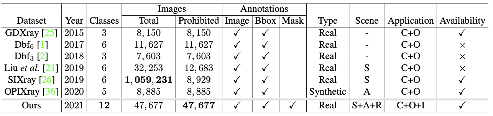
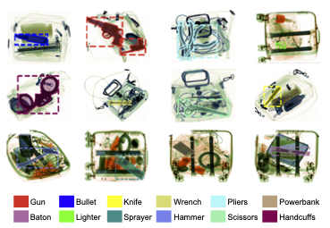
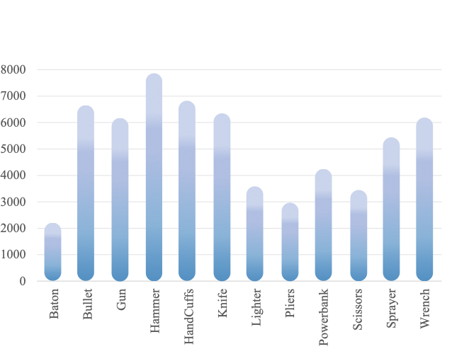
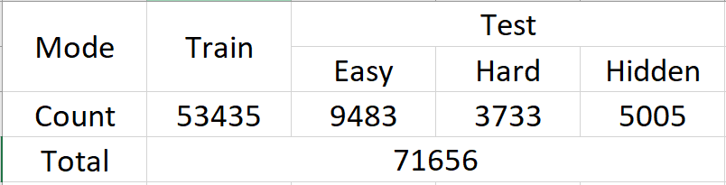
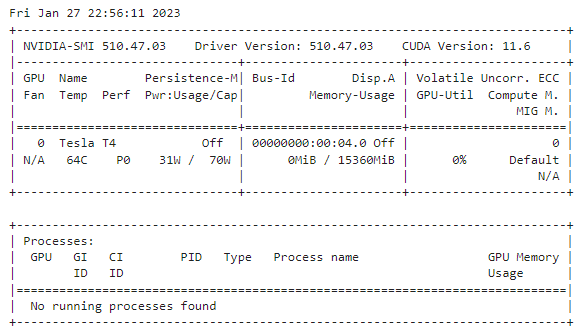

# Xraydetect_GR11

## Overview

Security inspection is a process of checking assets against set criteria and the evaluation of security systems and access controls to ensure safety, which is important to uncover any potential risks in various scenarios, such as public transportation and sensitive departments. In practice, the inspectors are required to monitor the scanned X-ray images acquired by the security inspection machine to uncover prohibited items, such as guns, ammunition, explosives, corrosive substances, toxic and radioactive substances. However, the inspectors struggle to localize prohibited items hidden in messy objects accurately and efficiently, which poses a great threat to safety.

Towards the prohibited item detection in real-world scenarios, we present a large-scale benchmark, i.e., PIDray, which is formed by 47, 677 images in total. To the best of our knowledge, it is the largest X-ray prohibited item detection dataset to date.

## Xray dataset

We compare the existing X-ray benchmarks as follows. “Total” and “Prohibited” indicate the number of total images and the images containing prohibited items in the dataset, respectively. C, O, and I represent Classification, Object Detection, and Instance Segmentation respectively. S, A, and R represent Subway, Airport, and Railway Station respectively.

There are a total of 12 categories of prohibited items defined in the dataset, namely gun, knife, wrench, pliers, scissors, hammer, handcuffs, baton, sprayer, powerbank, lighter and bullet. Each image is provided with image-level and instance-level annotation. For clarity, we show one category per image.
 

We use image rotation methods to increase the number of cases, then we divide all images into 53435 (about 75%) and 18,220 (25%) images respectively as training and test set . Also, according to the difficulty of forbidden item detection, we group the test set into three subsets, i.e. easy, hard and hidden. Specifically, easy mode means that the image in the test suite contains only one prohibited item. Hard mode indicates that the image in the test set contains more than one forbidden item. Stealth mode indicates that images in the test suite contain items that are intentionally hidden.

 

## Usage
1. Prerequisites:
  *Python 3.10.9 + CUDA 11.7 + Pytorch 1.13.1 + Torchvision 0.14.1 + Yolov8* 

2. Dataset 
- Google Drive: [Link](https://drive.google.com/file/d/1UMq0CP20lKcraOTvsFMjiLjPfDam9jAp/view)
- Roboflow: [Link1](https://universe.roboflow.com/hust-dz9h2/xraydetec4)
            [Link2](https://universe.roboflow.com/hust-3xurl/xraydetec2)
            [Link3](https://universe.roboflow.com/bkhn-huqf2/xraydetec5)
            
3. Clone the repository:
- Clone:
```sh
!git clone https://github.com/quangnm145/Xraydetect_GR11.git
%cd Xraydetect_GR11
```
- Setup:<space><space>
Let's make sure that we have access to GPU. We can use nvidia-smi command to do that. In case of any problems navigate to Edit -> Notebook settings -> Hardware accelerator, set it to GPU, and then click Save.

```sh
!nvidia-smi
```
 

YOLOv8 can be installed in two ways - from the source and via pip. This is because it is the first iteration of YOLO to have an official package.
```sh
!pip install ultralytics==8.0.20
from ultralytics import YOLO
from IPython.display import display, Image

import os
HOME = os.getcwd()
print(HOME)
```

4. Pre-train:

```sh
%cd {HOME}
!yolo task=detect mode=predict model=yolov8n.pt conf=0.25 source='https://media.roboflow.com/notebooks/examples/dog.jpeg' save=True
```

5. Train: 
```sh
!yolo task=detect mode=predict model=Xraydetect_GR11/module/best.pt conf=0.25 source=<Your_data>  save=True
```

6. Result
```sh
%cd {HOME}
Image(filename=f'{HOME}/runs/detect/train/confusion_matrix.png', width=600)
```
```sh
%cd {HOME}
Image(filename=f'{HOME}/runs/detect/train/results.png', width=600)
```
```sh
%cd {HOME}
Image(filename=f'{HOME}/runs/detect/train/val_batch0_pred.jpg', width=600)
```

## Reference
```sh
inproceedings{wang2021towards,
   title={Towards Real-World Prohibited Item Detection: A Large-Scale X-ray Benchmark},
   author={Wang, Boying and Zhang, Libo and Wen, Longyin and Liu, Xianglong and Wu, Yanjun},
   booktitle={Proceedings of the IEEE/CVF International Conference on Computer Vision},
   pages={5412--5421},
   year={2021}
}
```
## License
*The images and the corresponding annotations in PIDray Dataset can be used ONLY for academic purposes, NOT for commercial purposes.
Copyright © 2021 Institute of Software Chinese Academy of Sciences, University of Chinese Academy of Sciences
All rights reserved.*
